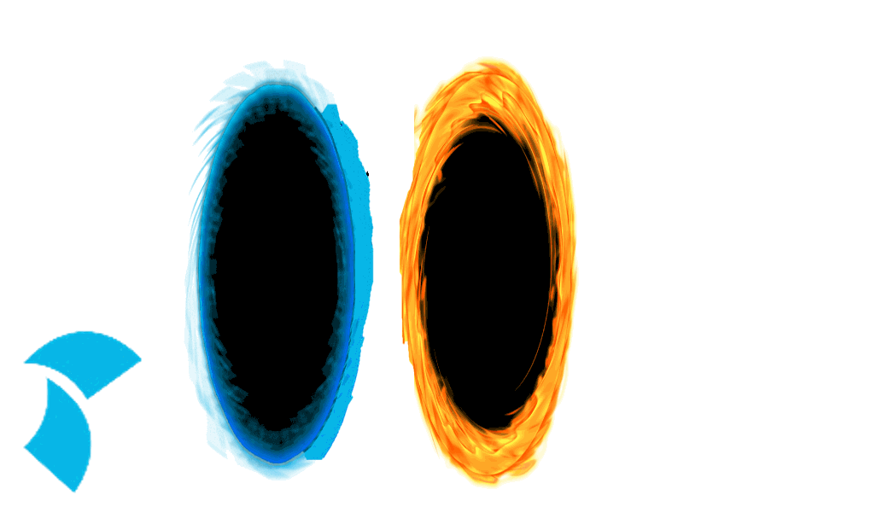

# Blaise CAWI Portal

Inialising Go
`go mod init github.com/onsdigital/blaise-cawi-portal`

TODO:
- Instrument Controller
    - Edge case tests
    - Draw pretty picture for Ken

    - Can we do anything nicer with timed out sessions?

- everything else will require auth stage 2
