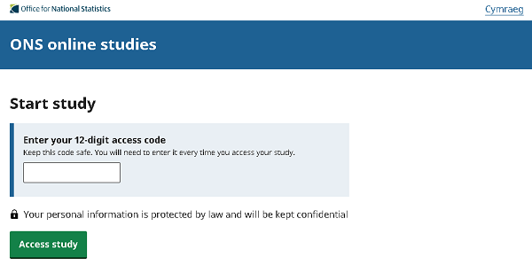

# Blaise CAWI Portal 

[](https://codecov.io/gh/ONSdigital/blaise-cawi-portal)
[](https://github.com/ONSdigital/blaise-cawi-portal/workflows/Test%20coverage%20report/badge.svg)
[](https://github.com/ONSdigital/blaise-cawi-portal/pulls)
[](https://github.com/ONSdigital/blaise-cawi-portal/commits)
[](https://github.com/ONSdigital/blaise-cawi-portal/graphs/contributors)
[](https://lgtm.com/projects/g/ONSdigital/blaise-cawi-portal/alerts/)

Web-based user interface for respondents to access their Blaise questionnaire via a Unique Access Code (UAC).

Records of a respondents questionnaire/instrument name, case serial number, and UAC are stored in the GCP NoSQL database Datastore. When a respondent enters their UAC we refer to Datastore to get their questionnaire/instrument name and case serial number, these are then passed to Blaise so the appropriate questionnaire/instrument and case are opened for the respondent.

[Blaise UAC Service (BUS)](https://github.com/ONSdigital/blaise-uac-service) generates the UACs. Can be used via the [Blaise UAC Service UI (BUS UI)](https://github.com/ONSdigital/blaise-uac-service-ui) or [Deploy Questionnaire Service (DQS)](https://github.com/ONSdigital/blaise-deploy-questionnaire-service).

The portal can be toggled between Welsh and English languages via a link on the top right-hand side of the page. The portal can be accessed directly in Welsh by providing the `?lang=cy` parameter in the URL. When in Welsh an additioinal `?Language=WLS` parameter will be sent to Blaise so that it knows to open the questionnaire in Welsh.



### Initialising Go

**Note**: This is a one off task per repo, but is being documented for future reference

```sh
go mod init github.com/onsdigital/blaise-cawi-portal
```

## Resolving Go setup issues

Are you getting the following error?

```sh
go: cannot find GOROOT directory: </dir/path/go/somewhere/libexec>
```

GOROOT is a variable that defines where your Go SDK is located. You do not need to change this variable, unless you plan to use different Go versions. go.mod is using Go 1.15. Ensure this is installed and point your GOROOT to the appropriate libexec folder.

For example:

```sh
brew install go@1.15
```

```sh
export GOROOT=</dir/path/something/like/go@1.15/1.15.15/libexec>
```

### Local Setup

Prerequisites:

- [Go](https://go.dev/)
- [Cloud SDK](https://cloud.google.com/sdk/)

Authenticate with GCP:
```shell
gcloud auth login
```

Set your GCP project:
```shell
gcloud config set project ons-blaise-v2-dev-sandbox123
```

Open a tunnel to our Blaise RESTful API in your GCP project:
```shell
gcloud compute start-iap-tunnel restapi-1 80 --local-host-port=localhost:90 --zone europe-west2-a
```

Download a service account JSON key:
```
gcloud iam service-accounts keys create keys.json --iam-account ons-blaise-v2-dev-sandbox123@appspot.gserviceaccount.com
```

Run the following commands to set the necessary environment variables locally:

Unix:

```
export BLAISE_ENV=dev-sandbox123
export DEV_MODE=true
export GOOGLE_APPLICATION_CREDENTIALS=keys.json
export OAUTH_NAME=$(gcloud alpha iap oauth-brands list --format=json | jq -r '.[] | select(.applicationTitle == "blaise").name')
export BUS_CLIENT_ID=$(gcloud alpha iap oauth-clients list "${OAUTH_NAME}" --format=json | jq -r '.[] | select(.displayName == "bus").name' | awk -F/ '{print $NF}')
export BUS_URL="https://${BLAISE_ENV}-bus.social-surveys.gcp.onsdigital.uk"
export CATI_URL="https://${BLAISE_ENV}-cati.social-surveys.gcp.onsdigital.uk"
export JWT_SECRET=00000000000000000000000000000000
export SESSION_SECRET=0000000000000000000000000000000000000000000000000000000000000000
export ENCRYPTION_SECRET=00000000000000000000000000000000
export PORT=8080
export BLAISE_REST_API=http://localhost:90
```

Windows:

```
set DEV_MODE=true
set GOOGLE_APPLICATION_CREDENTIALS=keys.json
set BUS_CLIENT_ID=<get from gcp console...>
set BUS_URL="https://dev-sandbox123-bus.social-surveys.gcp.onsdigital.uk"
set CATI_URL="https://dev-sandbox123-cati.social-surveys.gcp.onsdigital.uk"
set JWT_SECRET=00000000000000000000000000000000
set SESSION_SECRET=0000000000000000000000000000000000000000000000000000000000000000
set ENCRYPTION_SECRET=00000000000000000000000000000000
set PORT=8080
set BLAISE_REST_API=http://localhost:90
```

Run application:

```sh
go run main.go
```

The UI should now be accessible via:

http://localhost:8080/

Run tests:

```sh
go test ./...
```

Run linter:
```sh
make lint
```