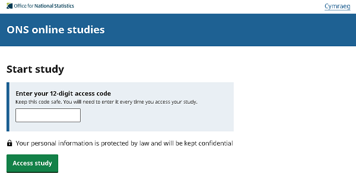

# Blaise CAWI Portal 

Web-based user interface for respondents to access their Blaise questionnaire via a Unique Access Code (UAC).

Each respondent's questionnaire/instrument name, case serial number, and UAC are stored in Datastore (GCP NoSQL). When a respondent enters their UAC, the portal queries Datastore to retrieve their questionnaire/instrument name and case serial number, which are then passed to Blaise to open the appropriate questionnaire and case.

UACs are generated by the [Blaise UAC Service (BUS)](https://github.com/ONSdigital/blaise-uac-service), which can be accessed via the [Blaise UAC Service UI (BUS UI)](https://github.com/ONSdigital/blaise-uac-service-ui) or the [Deploy Questionnaire Service (DQS)](https://github.com/ONSdigital/blaise-deploy-questionnaire-service).

The portal can be toggled between Welsh and English via a link in the top right of the page, or accessed directly in Welsh by providing the `?lang=cy` URL parameter. When in Welsh, an additional `?Language=WLS` parameter is sent to Blaise to open the questionnaire in Welsh.



## Local Development

### Prerequisites

- [Go](https://go.dev/)
- [Google Cloud SDK (`gcloud` CLI)](https://cloud.google.com/sdk/)

### Clone and install dependencies

```sh
git clone https://github.com/ONSDigital/blaise-cawi-portal.git
cd blaise-cawi-portal
make install
```

### Authenticate with Google Cloud (keyless)

Use service account impersonation to auth:

```sh
gcloud auth login
gcloud config set project ons-blaise-v2-dev-<sandbox>
gcloud auth application-default login --impersonate-service-account=ons-blaise-v2-dev-<sandbox>@appspot.gserviceaccount.com
```

### Start an IAP tunnel to Blaise REST API

Run this in a separate terminal and keep it running:

```sh
gcloud compute start-iap-tunnel restapi-1 80 --local-host-port=localhost:8080 --zone europe-west2-a
```

Expected output includes `Listening on port [8080]`.

### Configure environment variables

Set environment variables:

Unix (only need to change `BLAISE_ENV`):

```sh
export BLAISE_ENV=dev-sandbox123
export DEV_MODE=true
export ENABLE_HTTPS=false # set to true only when running locally over HTTPS
export DEBUG=false # set to true to enable proxy debug transport logging
export BUS_CLIENT_ID=$(gcloud app versions describe $(gcloud app versions list --service="cawi-portal" --sort-by="~version.createTime" --limit=1 --format="value(id)") --service="cawi-portal" --format="value(envVariables.BUS_CLIENT_ID)")
export BUS_URL="https://${BLAISE_ENV}-bus.social-surveys.gcp.onsdigital.uk"
export CATI_URL="https://${BLAISE_ENV}-cati.social-surveys.gcp.onsdigital.uk"
export JWT_SECRET=00000000000000000000000000000000
export SESSION_SECRET=0000000000000000000000000000000000000000000000000000000000000000
export ENCRYPTION_SECRET=00000000000000000000000000000000
export BLAISE_REST_API=http://localhost:8080
```

Windows:

You can find the BUS client IDs from the existing deployment:

App Engine -> Versions -> cawi-portal -> View Config

```sh
set DEV_MODE=true
set ENABLE_HTTPS=false
set BUS_CLIENT_ID=<get from gcp console...>
set BUS_URL="https://dev-sandbox123-bus.social-surveys.gcp.onsdigital.uk"
set CATI_URL="https://dev-sandbox123-cati.social-surveys.gcp.onsdigital.uk"
set JWT_SECRET=00000000000000000000000000000000
set SESSION_SECRET=0000000000000000000000000000000000000000000000000000000000000000
set ENCRYPTION_SECRET=00000000000000000000000000000000
set BLAISE_REST_API=http://localhost:8080
```

Not working? Try running BUS_URL and CATI_URL without the quotes.

### Run the service

```sh
go run .
```

The service listens on `http://localhost:8082` by default.

Run tests:

```sh
make test
```

Run linter:

```sh
make lint
```
